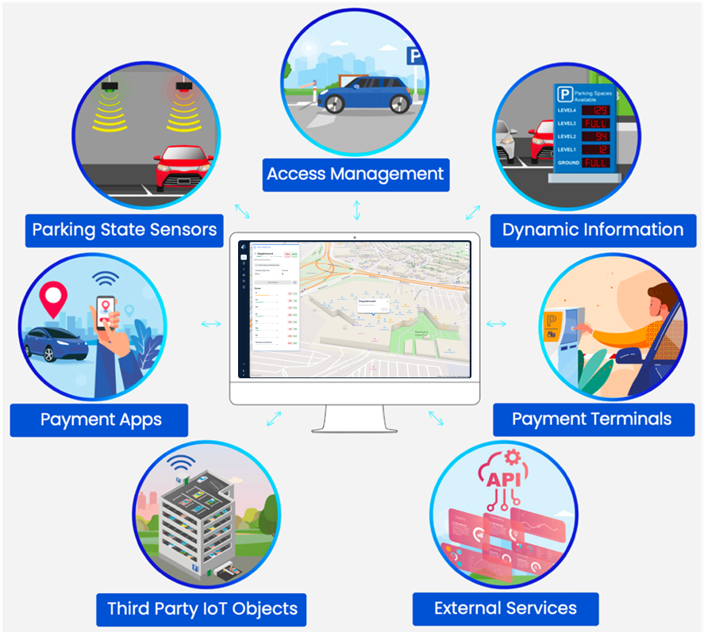

# About Spatium

Spatium is a platform designed for the management and optimization of parking performance, tailored for both private managers and public services. Spatium enables the integration of products and systems from multiple suppliers within a single interface, supporting a comprehensive ecosystem.

Spatium integrates products from major brands such as: The Dimonoff parking status detection system, ParkNet, Milesight, NuMedia, SignalTech, System TV by Infotraffic, Parquery, And others.

Spatium enables efficient management of a complete parking ecosystem through its ability to:

* Connect to an unlimited number of IoT technologies, actuators, and other devices (end users do not need programming skills to set up these connections)
* Connect to other applications and interfaces using an open and standardized Application Programming Interface (API), now ISO TS 5206-1 certified, using the Alliance for Parking Data Standards (APDS) model
* Provide security that encompasses both data and networks.

With a solution you can rely on, Spatium leverages the Internet of Things, laying the foundation for a scalable communications network architecture, allowing for the progressive integration of additional smart sensors and services for the benefit of citizens and clients.

Spatium adapts to your project environment to build the ideal ecosystem, as illustrated below.

<figure><figcaption></figcaption></figure>

The Spatium platform also supports many parking spot status detection technologies and related ecosystem attributes, such as:

* Indoor and outdoor detection cameras
* Detection on video streams from existing cameras
* License plate detection (alphanumeric license plate combinations and color)
* Detection of vehicle attributes (make, type, color, etc.)
* Vehicle counting at entrances/exits
* Pedestrian or cyclist detection and counting

