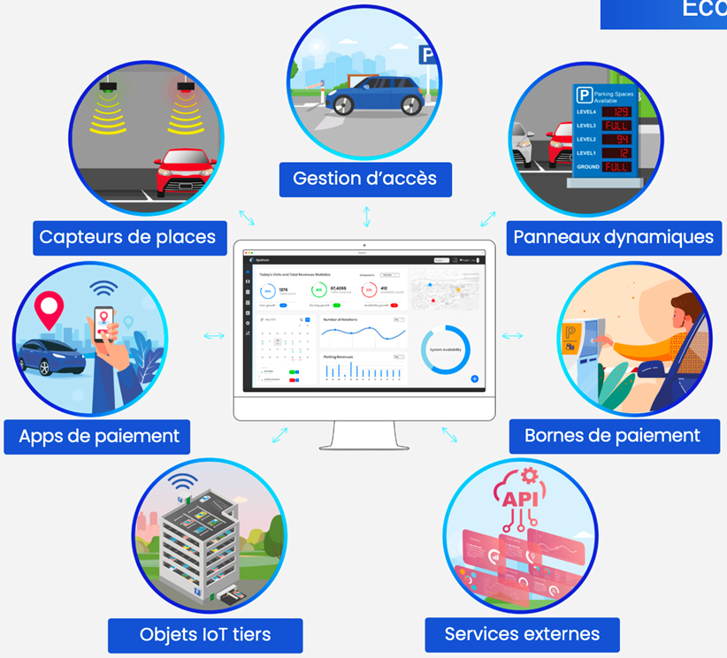

# À propos de Spatium

Spatium est une plateforme de gestion et d’optimisation des performances de stationnement, conçue pour les gestionnaires privés et les services publics. Spatium permet l’intégration de produits et systèmes provenant de plusieurs fournisseurs au sein d’une interface unique, afin de supporter un écosystème complet.

Spatium intègre des produits de grandes marques telles que : Le système de détection d’état de stationnement de Dimonoff, ParkNet, Milesight, NuMedia, SignalTech, System TV by Infotraffic, Parquery, Etc...

Spatium permet la gestion efficace d’un écosystème complet fait de différentes applications de stationnement grâce à son aptitude à :

* Se connecter à un nombre infini de technologies IoT, actionneurs et autres objets (les utilisateurs finaux n’ont pas besoin de compétences en programmation pour établir ces connexions)
* Se connecter à d’autres applications et interfaces, en utilisant une _Application Programming Interface_ (API) ouverte et standardisée, conforme à la norme ISO TS 5206-1, sur le modèle de l’Alliance for Parking Data Standards (APDS)
* Fournir de la sécurité couvrant à la fois les données et les réseaux.

Avec une solution sur laquelle vous pouvez compter, Spatium tire parti de l’Internet des objets, jetant les bases d’une architecture de réseau de communication évolutive, permettant l’intégration progressive de capteurs et services intelligents supplémentaires au profit des citoyens et des clients.

Spatium s’adapte dans votre environnement de projet pour y construire l’écosystème idéal tel qu’illustré ci-dessous.

<figure><figcaption></figcaption></figure>

La plateforme Spatium supporte également d’autres technologies de détection d’état de places de stationnement et d’attributs liés à ce même écosystème tel que :

* Des caméras de détection intérieures et extérieures
* La détection sur flux vidéo de caméras existantes
* La détection de plaques d’immatriculation (combinaison alphanumérique d’immatriculation et leur couleur)&#x20;
* La détection d’attributs des véhicules (marque, type, couleur, etc.)
* Le comptage de véhicules aux entrées/sorties
* La détection et le comptage de piétons ou de cyclistes.
