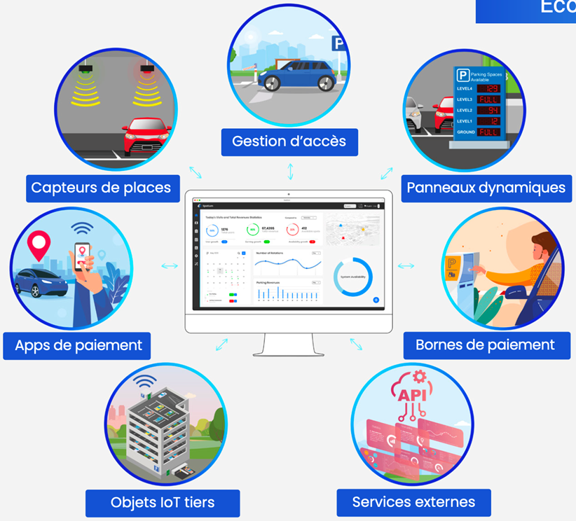

# Mises à jour produit



<!-- release-id: spatium-build-1060 -->

## Gestion des zones LPR

Si vous utilisez des caméras LPR Milesight, vous pouvez maintenant gérer les associations caméra-zone directement dans la vue d'une zone, sans devoir tout refaire une ligne à la fois.

Vous pouvez ajouter une caméra avec plusieurs zones de détection en une seule sauvegarde. Vous pouvez aussi ajouter une zone à une caméra existante sans retaper son numéro de série. Il est maintenant possible de renommer une zone de détection, renommer une caméra, changer son numéro de série, puis supprimer une zone précise ou une caméra complète à partir du même panneau.

La liste est maintenant regroupée par caméra. C’est beaucoup plus simple de voir quelles zones de détection vont ensemble et comment chacune contribue au comptage.

## Compteur LPR et corrections en direct

Les zones LPR ont maintenant un panneau dédié dans la vue de zone avec les chiffres d’occupation en direct, les comptes par caméra et les outils de correction au même endroit.

Vous pouvez voir la dernière correction, ajuster le compte courant manuellement, déclarer une zone vide et mettre à jour la capacité sans quitter la page. Le panneau se rafraîchit aussi quand la disponibilité de la zone change, ce qui aide à garder les chiffres alignés avec ce qui se passe sur le terrain.

Quand vous modifiez une zone LPR, Spatium affiche maintenant l’identifiant du compteur de zone en lecture seule, avec une option pour le copier. Pratique quand il faut faire le lien avec d’autre équipement sans partir à la chasse à l’identifiant.

## Correctifs

- Correctif d’un cas où la vue d’une zone pouvait rouvrir la zone consultée précédemment après la navigation.
- Correctif des associations de caméras LPR qui pouvaient se séparer en cartes en double quand le même numéro de série était saisi avec une casse différente.
- Correctif de problèmes de rafraîchissement dans le panneau LPR qui pouvaient laisser des valeurs périmées après une correction ou après avoir quitté la page.
- Correctif d’un formulaire d’association LPR orphelin qui pouvait rester affiché alors que l’élément lié n’existait plus.
- Rétablissement du comportement natif des boutons pour que les actions et les états désactivés fonctionnent comme prévu dans le Viewer.
- Correctif de la gestion des erreurs GraphQL qui pouvait sortir inutilement des utilisateurs de leur session ou créer une boucle après un refus d’opération.
- Correctif d’un échec de requête sur une zone qui pouvait faire tomber toute la page au lieu d’échouer plus proprement.



## Refonte de l’interface Viewer

Spatium a été rafraîchie avec une présentation plus claire et plus cohérente. La navigation, les en-têtes, les menus, les cartes et la vue principale ont été revus pour rendre l’interface plus facile à parcourir au quotidien.

<figure><figcaption></figcaption></figure>

<figure><figcaption></figcaption></figure>

## Configuration des panneaux intelligents TTS

Vous pouvez désormais configurer, surveiller et contrôler vos panneaux de guidage intelligents TTS depuis Spatium, ainsi que vos autres panneaux intelligents déjà supportés.

## Correctifs

* Correctif de l’affichage des snapshots dans le panneau de détail d’une place.
* Amélioration de l’image de l’écran de connexion en mode sombre pour qu’elle corresponde au thème actif.



## L'essentiel en un clin d'oeil grâce aux snapshots caméra

<figure><figcaption></figcaption></figure>

Spatium affiche désormais les snapshots de caméra pour les places équipées de caméras de guidage intérieur. Les opérateurs bénéficient ainsi d’un contexte visuel immédiat, exactement là où il est le plus utile, pour comprendre plus rapidement la situation sur site sans quitter leur flux de travail.

En intégrant ces images directement dans la vue d'une place, les équipes peuvent vérifier une situation plus rapidement, limiter les allers-retours et intervenir avec davantage de confiance. L’expérience de supervision devient plus fluide, plus visuelle, et pensée pour accélérer la prise de décision en temps réel.



## Rapport de revenus & analyses d'occupation

Cette version introduit une expérience de reporting enrichie dans Spatium, combinant de nouvelles fonctionnalités à des performances optimisées pour offrir des analyses plus claires et plus fiables de vos opérations de stationnement. Grâce à une meilleure visibilité sur l’occupation, l’usage et vos revenus, vous pouvez suivre vos performances en toute confiance, identifier les tendances et prendre des décisions plus éclairées — le tout depuis une seule plateforme.

### Nouveau rapport d’analyse de l’occupation

<figure><figcaption></figcaption></figure>

Obtenez une compréhension plus fine de l’utilisation réelle de vos espaces de stationnement. Le nouveau rapport d’analyse de l’occupation fournit des insights riches et exploitables sur les schémas d’occupation, les durées de stationnement atypiques et les périodes de forte affluence, grâce à des visualisations avancées et des filtres flexibles. Conçu pour faire émerger rapidement les tendances clés, il vous aide à optimiser vos opérations en toute confiance.

### Nouveau rapport de revenus

<figure><figcaption></figcaption></figure>

Gagnez en visibilité sur vos performances financières avec le nouveau rapport de revenus. En regroupant les indicateurs clés, ce rapport offre une vue complète et unifiée de vos flux de revenus. Grâce à des analyses intuitives et des découpages temporels, vous pouvez suivre vos performances facilement et identifier de nouvelles opportunités de croissance.

### Amélioration du rapport d’occupation

<figure><figcaption></figcaption></figure>

Bénéficiez d’un nouveau niveau de performance et de fiabilité dans vos analyses. Nous avons amélioré le rapport d'occupation qui s’appuie sur des requêtes optimisées pour fournir des insights plus rapides et plus cohérents sur entre autres l’occupation, les flux de visiteurs, le taux de rotation et la durée de stationnement. Avec une meilleure précision des données et une réactivité accrue, chaque indicateur devient un levier fiable pour piloter vos décisions opérationnelles.



## Page de notes de version

* Nouvelle page d'annonces de notes de version Gitbook


