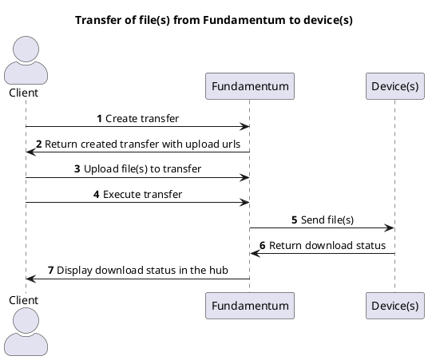
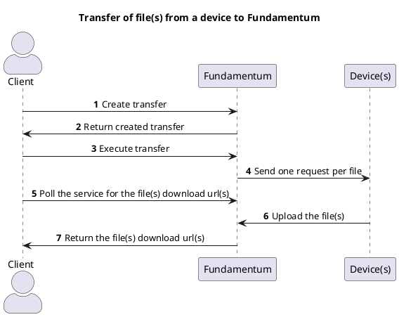

# File transfers

A file transfer can be performed in one of two directions: from Fundamentum to one or many device(s),
or from a device to Fundamentum.

## Transfer of one or many file(s) from Fundamentum to one or many device(s)

### Using the API

Overview



Detailed steps:

1. Create transfer
   - Call the [API](https://api.fundamentum-iot.com/docs#/operations/storeFileTransfer) to create a transfer with the cloud-to-device direction 
   - Specify file(s) you want to transfer
   - Specify device(s) you want to transfer to
   - The service will return the new transfer, along with an upload url for each file

2. Return created transfer with upload urls

3. Upload file(s)
   - For each of the files specified in the transfer, upload it with the secured link obtained during step 2, which is valid for 15 minutes

   ```shell
   curl --upload-file {LOCAL_FILE_PATH} {UPLOAD_URL}
   ```
   
4. Execute transfer
   - Call the [API](https://api.fundamentum-iot.com/docs#/operations/executeFileTransfer) with the identifier of the previously created transfer
   - The file(s) to transfer must all have been uploaded

5. Send file(s)
  - One action per file will be sent to the specified device(s)
  - The edge daemon on each device will receive the transfer action and emit a GRPC event
  - On each device, there must be a program which listens to those GRPC events, accepts the transfer, and download the files at the desired locations
  - The transfer action download status is visible in the Actions tab of each device page in the Fundamentum Hub

### Using the Fundamentum CLI

The CLI provides a convenient way to send a single file to a single device. He performs the first 4 steps in a single command.

```shell
fun devices transfer cloud-to-device -d {DEVICE_ID} -p {PROJECT_ID_CONTAINING_THE_DEVICE} \
   -r {REGISTRY_ID_CONTAINING_THE_DEVICE} -f {LOCAL_PATH_OF_FILE_TO_TRANSFER} \
   --remote-path {PATH_ON_THE_DEVICE_WHERE_THE_FILE_WILL_BE_SAVED}
```

## Transfer of file(s) from a device to Fundamentum

Unlike transfers **to** a device, transfers **from** a device are limited to a single device.

### Using the API

Overview



Detailed steps:

1. Create transfer
   - Call the [API](https://api.fundamentum-iot.com/docs#/operations/storeFileTransfer) to create a transfer with the device-to-cloud direction
   - Specify file(s) to request
   - Specify the device to transfer from

2. Return created transfer
   
3. Execute transfer
   - Call the [API](https://api.fundamentum-iot.com/docs#/operations/executeFileTransfer) with the identifier of the previously created transfer

4. Send file request(s)
   - One request action per file will be sent to the specified device
   - The edge daemon running on the device will receive the transfer action and emit a GRPC event
   - There must be a program on the device that listens to those GRPC events, accepts transfers, and upload files

5. Poll the service for the file(s) download url(s)
   - Call the [API](https://api.fundamentum-iot.com/docs#/operations/getFileTransferFiles) with the identifier of the previously created transfer
   - If the file(s) has/have been uploaded by the device, this API will return its download link(s), which is valid for 15 minutes
   - Call this repeatedly until the device has uploaded all file(s)
   - Download the file(s) from the url(s)

   ```shell
   curl -o {PATH_WHERE_TO_SAVE_THE_FILE} {DOWNLOAD_URL}
   ```

### Using the Fundamentum CLI

The CLI provides a convenient way to request a file from a single device. It executed the first 4 steps above in a single command.

```shell
fun devices transfer device-to-cloud -d {DEVICE_ID} -p {PROJECT_ID} \
   -r {REGISTRY_ID} -n {NAME_FOR_THE_FILE_WHEN_DOWNLOADED} \
   --remote-path {FILE_PATH_ON_THE_DEVICE}
```

## Implementation of a program to handle file transfers (both directions) on a device

### Proto files

Devices communicate with Fundamentum using [Protobuf](https://protobuf.dev/). The format is defined in these files.

https://bitbucket.org/amotus/fundamentum-edge-proto

### Sample (in Go)

Go dependencies:

```
google.golang.org/grpc v1.70.0
google.golang.org/protobuf v1.36.1
```

Other tools:

[Protoc](https://protobuf.dev/installation/)

Generate .pb go files from the proto files (bash script):

```shell
#!/usr/bin/env bash
set -euo pipefail
shopt -s nullglob

go install google.golang.org/protobuf/cmd/protoc-gen-go@v1.28
go install google.golang.org/grpc/cmd/protoc-gen-go-grpc@v1.2

cd "{{source_directory()}}/proto"
files=(*.proto **/*.proto)
opts=()
grpc_opts=()
for f in "${files[@]}"; do
  g=`realpath $f`
  opts+=( "--go_opt=M$f=$(dirname "path/to/proto/$f");$(basename "${g%/*}")" )
  grpc_opts+=("--go-grpc_opt=M$f=$(dirname "path/to/proto/$f");$(basename "${g%/*}")")
done
set -x
protoc --proto_path=. --go_out=. --go_opt=paths=source_relative "${opts[@]}" --go-grpc_out=. --go-grpc_opt=paths=source_relative "${grpc_opts[@]}" "${files[@]}"
```

Go code:

```go
package main

import (
   "context"
   "crypto/sha512"
   "encoding/base64"
   "fmt"
   "io"
   "os"

   pb "path/to/pb" // pb générés à partir des protos

   "google.golang.org/grpc"
   "google.golang.org/grpc/credentials/insecure"
)

func ListenToFileTransfers(ctx context.Context, rpcUrl string) error {
   transportOptions := grpc.WithTransportCredentials(insecure.NewCredentials())
   conn, err := grpc.NewClient(rpcUrl, transportOptions)
   fileTransferClient := pb.NewFileTransferClient(conn)

   subscription, err := fileTransferClient.Subscribe(ctx, nil)
   if err != nil {
      return err
   }

   for {
      fmt.Println("Waiting for file transfer...")
      req, err := subscription.Recv()
      if err != nil {
         return fmt.Errorf("error receiving file transfer request: %w", err)
      }

      err = handleFileRequest(ctx, req)
      if err != nil {
         return fmt.Errorf("error handling file transfer request: %w", err)
      }
   }
}

func handleFileRequest(ctx context.Context, req *pb.FileTransferRequest) error {
   fmt.Println("Handling file request")
   if req.GetDownload() != nil {
      return handleDownload(ctx, req.GetActionId(), req.GetDownload().GetSize())
   }

   return handleUpload(ctx, req.GetActionId(), req.GetUpload().GetFilePath())
}

func handleDownload(ctx context.Context, actionId *pb.ActionId, size uint64) error {
   fmt.Println("Handling download")
   // This always accept requests for demo purposes, but we could refuse based on some criteria
   responseStream, err := fileTransferClient.DownloadFile(ctx, &pb.DownloadFileRequest{
      ActionId: actionId,
   })
   if err != nil {
      return fmt.Errorf("error handling download request: %w", err)
   }

   totalData := make([]byte, size)
   fmt.Println(fmt.Sprintf("Downloading %d bytes", size))

   // Receive all response chunks from the stream
   for {
      resp, err := responseStream.Recv()
      if err == io.EOF {
         fmt.Println("File download completed, all chunks received. File contents:")
         fmt.Println(string(totalData))
		 // TODO save file at remote path in request
         fmt.Println()
         break
      }
      if err != nil {
         return fmt.Errorf("error receiving file download chunk: %w", err)
      }

      chunkData := resp.GetChunk().GetData()
      fmt.Println(fmt.Sprintf("Copying data chunk from byte %d to %d", resp.GetChunk().GetIndex(), uint64(len(chunkData))+resp.GetChunk().GetIndex()))
      for i, b := range chunkData {
         totalData[resp.GetChunk().GetIndex()+uint64(i)] = b
      }
   }

   return nil
}

func handleUpload(ctx context.Context, actionId *pb.ActionId, filePath string) error {
   fmt.Println("Handling upload")
   // This always accept requests for demo purposes, but we could refuse based on some criteria
   responseStream, err := fileTransferClient.UploadFile(ctx)
   if err != nil {
      return fmt.Errorf("error creating upload stream: %w", err)
   }
   fmt.Println(fmt.Sprintf("Reading test file to upload (filePath=%s)", filePath))
   data, err := os.ReadFile(filePath)
   if err != nil {
      return fmt.Errorf("error reading test file: %w", err)
   }

   hash512 := sha512.Sum512(data)
   sriHash := "sha512-" + base64.StdEncoding.EncodeToString(hash512[:])

   fmt.Printf("Uploading headers (actionId=%d, size=%d, hash=%s)\n", actionId.GetId(), uint64(len(data)), sriHash)
   err = responseStream.Send(&pb.UploadFileRequest{
      Payload: &pb.UploadFileRequest_Header_{Header: &pb.UploadFileRequest_Header{
         ActionId: actionId,
         Size:     uint64(len(data)),
         Hash:     sriHash,
      }},
   })
   if err != nil {
      return fmt.Errorf("error sending upload header: %w", err)
   }
   start := uint64(0)
   fmt.Println("Uploading test file contents")
   err = responseStream.Send(&pb.UploadFileRequest{
      Payload: &pb.UploadFileRequest_Chunk_{Chunk: &pb.UploadFileRequest_Chunk{
         Inner: &pb.FileChunk{
            Index: &start,
            Data:  data,
         },
      }},
   })
   if err != nil {
      return fmt.Errorf("error sending upload chunk: %w", err)
   }
   _, err = responseStream.CloseAndRecv()
   if err != nil {
      return fmt.Errorf("error closing upload streanm: %w", err)
   }
   fmt.Println("Upload complete")
   fmt.Println(string(data))
   fmt.Println()
   return nil
}
```