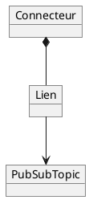

# PubSub Bridge

Le PubSub Bridge Adapter permet d’accéder aux messages des projets via le courtier d’événements interne de Fundamentum. Cela s’effectue au moyen d’un connecteur et d’au moins un lien.

Les interactions avec le PubSub Bridge reposent sur trois objets : les **connecteurs**, les **liens** et les ***topics PubSub***.



Un **connecteur** définit les paramètres nécessaires pour se connecter à un courtier externe. Son type (MQTT, MQTTS, HTTPS) détermine le protocole utilisé.

Un **lien** associe un *topic PubSub* à une ressource externe (*topic* MQTT ou route HTTPS) via son connecteur. La direction (entrant ou sortant) dépend du type du *topic PubSub*.

Restrictions :  
- Avec MQTT(S), un même topic externe ne peut pas être utilisé simultanément par un lien entrant et un lien sortant  
- Un seul lien entrant est autorisé par paire (*topic* externe, *topic PubSub*)

Note : Un **lien entrant** publie vers Fundamentum. Un **lien sortant** transmet les messages émis par Fundamentum.

Les ***topics PubSub*** sont des topics dans le courtier d’événements de Fundamentum, accessibles via le PubSub Bridge. Ils sont unidirectionnels : soit souscription, soit publication.

Les *topics* suivants sont créés par défaut pour chaque projet :  
- `projects.N.topics.states`
- `projects.N.topics.readings`
- `projects.N.topics.custom_actions`  

Les *topics PubSub* ont un type par défaut définissant leur direction (c.-à-d. souscription ou publication). Les valeurs possibles sont :
- **States** : souscription uniquement  
- **Telemetry** : souscription uniquement  
- **Custom Actions** : publication uniquement  

Les noms des *topics PubSub* doivent contenir uniquement des caractères alphanumériques et comporter au moins 3 caractères. Ils sont préfixés automatiquement par `projects.N.topics` où `N` est l’identifiant du projet.

## Mise en place

### MQTT & MQTTS


Pour utiliser un connecteur MQTT(S), vous aurez besoin d’un serveur MQTT accessible par Internet ainsi que d’un client MQTT pour publier ou consommer des messages.

<details>
  <summary>Hub</summary>

  #### 1. Créer le connecteur

  Pour les connecteurs MQTT, les champs suivants sont disponibles :  
  - Hostname\* : Nom d’hôte du courtier MQTT  
  - Port\* : Port du courtier MQTT (habituellement 1883 pour MQTT et 8883 pour MQTTS)  
  - Client ID\* : Identifiant client utilisé par le client MQTT de Fundamentum  
  - Username : Nom d’utilisateur pour l’authentification par mot de passe  
  - Password : Mot de passe pour l’authentification par mot de passe  

  Les connecteurs MQTTS possèdent les champs additionnels suivants :  
  - CA Certificate\*\* : Fichier PEM contenant le certificat de l’autorité de certification  
  - Client Certificate\*\* : Fichier PEM contenant le certificat utilisé par le client MQTT  
  - Client Key\*\* : Fichier PEM contenant la clé privée associée au certificat client  

  \* Champs obligatoires.  
  \*\* L’extension du fichier n’a pas d’importance, seul son contenu compte.

  1. Naviguez vers **Connectors**  
  2. Cliquez sur **New Connector**  
  3. Sélectionnez le type d’adaptateur (MQTT ou MQTTS)  
  4. Remplissez les champs  
  5. Cliquez sur **Save**

  Le connecteur est maintenant créé. Il tentera de se connecter à l’hôte spécifié. Pour vérifier la connexion, utilisez le bouton **Status** de la page **Connectors**.

  #### 2. Créer le *topic PubSub*
  
  Étape optionnelle si vous utilisez un des topics créés par défaut.

  1. Naviguez vers **PubSub topics**  
  2. Cliquez sur **New Topic**  
  3. Remplissez les champs  
  4. Cliquez sur **Save**

  #### 3. Créer le lien
  
  1. Naviguez vers **Connectors**  
  2. Cliquez sur **Links**  
  3. Cliquez sur **New Link**  
     - Premier tableau : liens sortants (souscription)  
     - Second tableau : liens entrants (publication)  
     - La direction peut être modifiée dans la page du lien  
  4. Sélectionnez le *topic PubSub* et le *topic* externe  
  5. Cliquez sur **Save**

  #### 4. Publier ou souscrire

  Pour publier sur un lien entrant, publiez un message à votre courtier MQTT sur le *topic* choisi lors de la création du lien. Format attendu :

  ```json
  {
    "device_id": int,
    "registry_id": int,
    "version": string, // optionnel
    "data": string
  }
  ```

  - `device_id`, `registry_id` et `version` deviennent des en-têtes  
  - `data` devient le corps du message

  Pour recevoir les messages d’un lien sortant, souscrivez au *topic* choisi sur votre courtier MQTT avec le client de votre choix. Les messages reçus sur le *topic PubSub* sont transmis tels quels à ce *topic*.
</details>

<details>
  <summary>API</summary>

  #### 1. Créer le connecteur

  Appelez l’[API](https://api.fundamentum-iot.com/docs#/operations/storeConnector) pour créer le connecteur.

  Clés possibles pour `connection_string` :
  - `host`\* : Nom d’hôte du courtier MQTT  
  - `port`\* : Port du courtier MQTT (habituellement 1883 pour MQTT et 8883 pour MQTTS)  
  - `clientid`\* : Identifiant client utilisé par le client MQTT de Fundamentum  
  - `username` : Nom d’utilisateur  
  - `password` : Mot de passe  

  Pour MQTTS :
  - `ca_cert`\*\* : Contenu PEM du certificat de l’autorité de certification  
  - `client_cert`\*\* : Contenu PEM du certificat client  
  - `client_key`\*\* : Contenu PEM de la clé privée client  

  \* Champs obligatoires.  
  \*\* Le contenu du fichier doit être utilisé comme valeur.

  Les champs sensibles (`password`, `ca_cert`, `client_cert`, `client_key`) doivent contenir un placeholder `%{nom_du_champ}%`. La valeur réelle est fournie dans `placeholders`.

  Le connecteur est maintenant créé. Il tentera de se connecter à l’hôte spécifié. Pour vérifier la connexion, utilisez l’[API](https://api.fundamentum-iot.com/docs#/operations/getConnectorStatus) avec l’identifiant du connecteur.

  #### 2. Créer le *topic PubSub*
  
  Étape optionnelle si vous utilisez un des *topics* créés par défaut.

  Appelez l’[API](https://api.fundamentum-iot.com/docs#/operations/storePubSubTopic) pour créer le *topic PubSub*.  
  Consulter les *topics* existants via l’[API](https://api.fundamentum-iot.com/docs#/operations/listPubSubTopics).

  #### 3. Créer le lien

  Appelez l’[API](https://api.fundamentum-iot.com/docs#/operations/storeLink) pour créer le lien à partir de l’identifiant du connecteur (étape 1) et du *topic PubSub* (étape 2).

  #### 4. Publier ou souscrire

  Pour publier sur un lien entrant, publiez un message à votre courtier MQTT sur le *topic* choisi lors de la création du lien. Format attendu :

  ```json
  {
    "device_id": int,
    "registry_id": int,
    "version": string, // optionnel
    "data": string
  }
  ```

  - `device_id`, `registry_id` et `version` deviennent des en-têtes  
  - `data` devient le corps du message

  Pour recevoir les messages d’un lien sortant, souscrivez au *topic* choisi sur votre courtier MQTT avec le client de votre choix. Les messages reçus sur le *topic PubSub* sont transmis tels quels à ce *topic*.
</details>

### HTTPS


Pour un lien entrant HTTPS, vous aurez besoin d’un serveur HTTPS accessible par Internet ainsi que d’une route qui accepte la méthode POST. Une requête sera effectuée sur cette route pour chaque message à transmettre.

Pour un lien sortant HTTPS, vous aurez besoin d’un client HTTP.

<details>
  <summary>Hub</summary>

  #### 1. Créer le connecteur

  Les connecteurs HTTPS possèdent les champs suivants (utilisés uniquement pour les liens sortants) :
  - Host : URL de base HTTPS (ex. https://www.example.com). La valeur doit commencer par `https://`.  
  - Custom Header Name : Nom de l’en-tête personnalisé.  
  - Custom Header Value : Valeur de l’en-tête personnalisé.  

  Si "Custom Header Name" et "Custom Header Value" ont tous les deux une valeur, un en-tête HTTP avec ces valeurs sera ajouté à chaque message transmis.

  1. Naviguez vers **Connectors**  
  2. Cliquez sur **New Connector**  
  3. Sélectionnez le type d’adaptateur HTTPS  
  4. Remplissez les champs  
  5. Cliquez sur **Save**

  Le connecteur est maintenant créé. Il tentera de se connecter à l’hôte spécifié. Pour vérifier la connexion, utilisez le bouton **Status**.

  #### 2. Créer le *topic PubSub*
  
  Étape optionnelle si vous utilisez un des topics créés par défaut.

  1. Naviguez vers **PubSub topics**  
  2. Cliquez sur **New Topic**  
  3. Remplissez les champs  
  4. Cliquez sur **Save**

  #### 3. Créer le lien
  
  1. Naviguez vers **Connectors**  
  2. Cliquez sur **Links**  
  3. Cliquez sur **New Link**  
     - Premier tableau : liens sortants (souscription)  
     - Second tableau : liens entrants (publication)  
     - La direction peut être modifiée dans la page du lien  
  4. Sélectionnez le *topic PubSub* et la route  
     - La route est modifiable uniquement pour les liens sortants  
  5. Cliquez sur **Save**

  #### 4. Publier ou souscrire

  Pour publier sur un lien entrant, utilisez l’[API](https://api.fundamentum-iot.com/docs#/operations/publishLink) avec l’identifiant du lien et celui du connecteur. 

  Le corps de la requête sera transformé en message :  
  - `device_id`, `registry_id` et `version` deviennent des en-têtes  
  - `data` devient le corps du message

  Lorsqu’un message est reçu sur le *topic PubSub* sélectionné, une requête HTTP est faite à l’URL suivante : `POST {Host du connecteur}/{Route du lien}` avec le contenu du message comme corps de la requête.
</details>

<details>
  <summary>API</summary>

  #### 1. Créer le connecteur

  Appelez l’[API](https://api.fundamentum-iot.com/docs#/operations/storeConnector) pour créer le connecteur.

  Clés possibles pour `connection_string` (utilisées uniquement pour les liens sortants) :
  - `host` : URL de base HTTPS (ex. https://www.example.com). La valeur doit commencer par `https://`.  
  - `headername` : Nom de l’en-tête personnalisé.  
  - `headervalue` : Valeur de l’en-tête personnalisé.  

  Si `headername` et `headervalue` ont tous les deux une valeur, un en-tête HTTP avec ces valeurs sera ajouté à chaque message transmis.

  Le connecteur est maintenant créé. Il tentera de se connecter à l’hôte spécifié. Pour vérifier la connexion, utilisez l’[API](https://api.fundamentum-iot.com/docs#/operations/getConnectorStatus).

  #### 2. Créer le *topic PubSub*
  
  Étape optionnelle si vous utilisez un des *topics* créés par défaut.

  Appelez l’[API](https://api.fundamentum-iot.com/docs#/operations/storePubSubTopic) pour créer le *topic PubSub*.  
  Consulter les *topics* existants via l’[API](https://api.fundamentum-iot.com/docs#/operations/listPubSubTopics).

  #### 3. Créer le lien
  
  Appelez l’[API](https://api.fundamentum-iot.com/docs#/operations/storeLink) pour créer le lien à partir de l’identifiant du connecteur et du *topic PubSub*.

  Pour un lien entrant, la valeur de `external_topic_name` peut être quelconque (non utilisée).  
  Pour un lien sortant, `external_topic_name` doit être la route du serveur HTTPS recevant les requêtes contenant les messages.

  #### 4. Publier ou souscrire

  Pour publier sur un lien entrant, utilisez l’[API](https://api.fundamentum-iot.com/docs#/operations/publishLink).

  Le corps de la requête sera transformé en message :  
  - `device_id`, `registry_id` et `version` deviennent des en-têtes  
  - `data` devient le corps du message

  Lorsqu’un message est reçu sur le *topic PubSub* sélectionné, une requête HTTP est faite à l’URL suivante : `POST {Host du connecteur}/{Route du lien}` avec le contenu du message comme corps de la requête.
</details>
