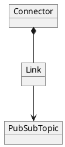
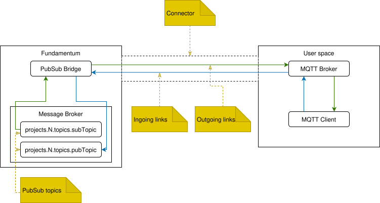
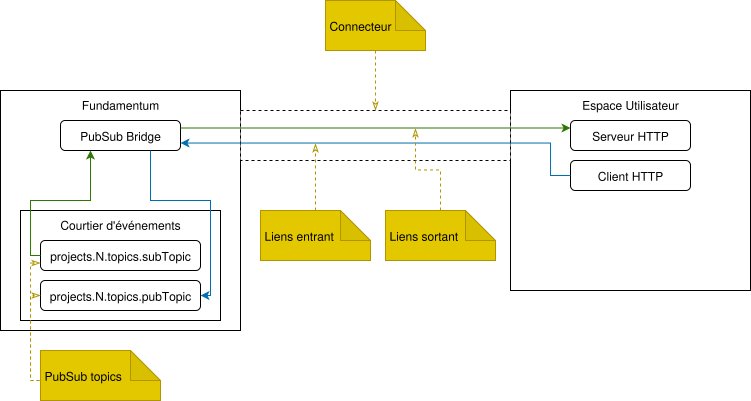

# PubSub Bridge

The PubSub Bridge Adapter allows access to project messages via Fundamentum’s internal event broker. This is done through a connector and at least one link.

Interactions with the PubSub Bridge rely on three objects: **connectors**, **links**, and **PubSub topics**.



A **connector** defines the parameters required to connect to an external broker. Its type (MQTT, MQTTS, HTTPS) determines the protocol used.

A **link** associates a PubSub topic with an external resource (MQTT topic or HTTPS route) via its connector. The direction (ingoing or outgoing) depends on the type of the PubSub topic.

Restrictions:  
- With MQTT(S), the same external topic cannot be used simultaneously by an ingoing link and an outgoing link  
- Only one ingoing link is allowed per pair (external topic, PubSub topic)

Note: An **ingoing link** publishes to Fundamentum. An **outgoing link** forwards messages emitted by Fundamentum.

**PubSub topics** are topics in Fundamentum’s event broker, accessible via the PubSub Bridge. They are unidirectional: either subscribe-only or publish-only.

The following topics are created by default for each project:  
- `projects.N.topics.states`
- `projects.N.topics.readings`
- `projects.N.topics.custom_actions`  

PubSub topics have a default type defining their direction (i.e., subscribing or publishing). Possible values are:
- **States**: subscribing only  
- **Telemetry**: subscribing only  
- **Custom Actions**: publishing only  

PubSub topic names must contain only alphanumeric characters and be at least 3 characters long. They are automatically prefixed with `projects.N.topics` where `N` is the project identifier.

## Setup

### MQTT & MQTTS



To use an MQTT(S) connector, you will need an MQTT server accessible from the Internet as well as an MQTT client to publish or consume messages.

<details>
  <summary>Hub</summary>

  Fundamentum's hub is accessible [here](https://hub.fundamentum-iot.com/). The PubSub bridge uses its [Connectors](https://hub.fundamentum-iot.com/connectors) and [PubSub](https://hub.fundamentum-iot.com/pub-sub-topics) pages which can be accessed using the sidebar on the left of the page. The **Connectors** page handles both connectors and links while the **PubSub** page handles PubSub topics.

  #### 1. Create the connector

  For MQTT connectors, the following fields are available:  
  - Hostname\*: MQTT Broker hostname  
  - Port\*: MQTT Broker port (typically 1883 for MQTT and 8883 for MQTTS)  
  - Client ID\*: Client identifier used by Fundamentum’s MQTT client  
  - Username: Username for password authentication  
  - Password: Password for password authentication  

  MQTTS connectors have the following additional fields:  
  - CA Certificate\*\*: PEM file containing the certificate of the certificate authority  
  - Client Certificate\*\*: PEM file containing the certificate used by the MQTT client  
  - Client Key\*\*: PEM file containing the private key associated with the client certificate  

  \* Required fields.  
  \*\* File extension does not matter, only its content.

  1. Navigate to **Connectors**  
  2. Click **New Connector**  
  3. Select the adapter type (MQTT or MQTTS)  
  4. Fill in the fields  
  5. Click **Save**

  The connector is now created. It will attempt to connect to the specified host. To verify the connection, use the **Status** button on the **Connectors** page.

  #### 2. Create the PubSub topic
  
  Optional step if you use one of the default topics.

  1. Navigate to **PubSub topics**  
  2. Click **New Topic**  
  3. Fill in the fields  
  4. Click **Save**

  #### 3. Create the link
  
  1. Navigate to **Connectors**  
  2. Click **Links**  
  3. Click **New Link**  
     - First table: outgoing links (subscribe)  
     - Second table: ingoing links (publish)  
     - The direction can be modified on the link page  
  4. Select the *PubSub topic* and the external *topic*  
  5. Click **Save**

  #### 4. Publish or subscribe

  To publish on an ingoing link, publish a message to your MQTT broker on the topic chosen when creating the link. Expected format:

  ```json
  {
    "device_id": int,
    "registry_id": int,
    "version": string, // optional
    "data": string
  }
  ```

  - `device_id`, `registry_id` and `version` become headers  
  - `data` becomes the message body

  To receive messages from an outgoing link, subscribe to the chosen *topic* on your MQTT broker with the client of your choice. Messages received on the PubSub topic are forwarded as-is to this topic.
</details>

<details>
  <summary>API</summary>

  #### 1. Create the connector

  Call the [API](https://api.fundamentum-iot.com/docs#/operations/storeConnector) to create the connector.

  Possible keys for `connection_string`:
  - `host`\*: MQTT broker hostname  
  - `port`\*: MQTT broker port (typically 1883 for MQTT and 8883 for MQTTS)  
  - `clientid`\*: Client identifier used by Fundamentum’s MQTT client  
  - `username`: Username for password authentication
  - `password`: Password for password authentication

  For MQTTS:
  - `ca_cert`\*\*: PEM content of the certificate of the certificate authority  
  - `client_cert`\*\*: PEM content of the client certificate used by the MQTT client 
  - `client_key`\*\*: PEM content of the private key associated with the client certificate  

  \* Required fields.  
  \*\* The file content must be used as the value.

  Sensitive fields (`password`, `ca_cert`, `client_cert`, `client_key`) must contain a placeholder `%{field_name}%`. The actual value is provided in `placeholders`.

  The connector is now created. It will attempt to connect to the specified host. To verify the connection, use the [API](https://api.fundamentum-iot.com/docs#/operations/getConnectorStatus) with the connector identifier.

  #### 2. Create the PubSub topic
  
  Optional step if you use one of the default topics.

  Call the [API](https://api.fundamentum-iot.com/docs#/operations/storePubSubTopic) to create the PubSub topic.  
  View existing topics via the [API](https://api.fundamentum-iot.com/docs#/operations/listPubSubTopics).

  #### 3. Create the link

  Call the [API](https://api.fundamentum-iot.com/docs#/operations/storeLink) to create the link using the connector identifier (step 1) and the PubSub topic (step 2).

  #### 4. Publish or subscribe

  To publish on an ingoing link, publish a message to your MQTT broker on the topic chosen when creating the link. Expected format:

  ```json
  {
    "device_id": int,
    "registry_id": int,
    "version": string, // optional
    "data": string
  }
  ```

  - `device_id`, `registry_id` and `version` become headers  
  - `data` becomes the message body

  To receive messages from an outgoing link, subscribe to the chosen topic on your MQTT broker with the client of your choice. Messages received on the PubSub topic are forwarded as-is to this topic.
</details>

### HTTPS



For an HTTPS outgoing link, you will need an HTTPS server accessible from the Internet and a route that accepts the POST method. A request will be made to this route for each message to be transmitted.

For an HTTPS ingoing link, you will need an HTTP client.

<details>
  <summary>Hub</summary>

  Fundamentum's hub is accessible [here](https://hub.fundamentum-iot.com/). The PubSub bridge uses its [Connectors](https://hub.fundamentum-iot.com/connectors) and [PubSub](https://hub.fundamentum-iot.com/pub-sub-topics) pages which can be accessed using the sidebar on the left of the page. The **Connectors** page handles both connectors and links while the **PubSub** page handles PubSub topics.
  
  #### 1. Create the connector

  HTTPS connectors have the following fields (used only for outgoing links):
  - Host: Base HTTPS URL (e.g., https://www.example.com). The value must start with `https://`.  
  - Custom Header Name: Name of the custom header.  
  - Custom Header Value: Value of the custom header.  

  If both "Custom Header Name" and "Custom Header Value" have a value, an HTTP header with these values will be added to each transmitted message.

  1. Navigate to **Connectors**  
  2. Click **New Connector**  
  3. Select the HTTPS adapter type  
  4. Fill in the fields  
  5. Click **Save**

  The connector is now created. It will attempt to connect to the specified host. To verify the connection, use the **Status** button.

  #### 2. Create the PubSub topic
  
  Optional step if you use one of the default topics.

  1. Navigate to **PubSub topics**  
  2. Click **New Topic**  
  3. Fill in the fields  
  4. Click **Save**

  #### 3. Create the link
  
  1. Navigate to **Connectors**  
  2. Click **Links**  
  3. Click **New Link**  
     - First table: outgoing links (subscription)  
     - Second table: ingoing links (publication)  
     - The direction can be modified on the link page  
  4. Select the *PubSub topic* and the route  
     - The route is modifiable only for outgoing links  
  5. Click **Save**

  #### 4. Publish or subscribe

  To publish on an ingoing link, use the [API](https://api.fundamentum-iot.com/docs#/operations/publishLink) with the link identifier and the connector identifier. 

  The request body will be transformed into a message:  
  - `device_id`, `registry_id` and `version` become headers  
  - `data` becomes the message body

    When a message is received on an outgoing link's PubSub topic, an HTTP request is made to the following URL: `POST {Connector Host}/{Link Route}` with the message content as the request body.
</details>

<details>
  <summary>API</summary>

  #### 1. Create the connector

  Call the [API](https://api.fundamentum-iot.com/docs#/operations/storeConnector) to create the connector.

  Possible keys for `connection_string` (used only for outgoing links):
  - `host`: Base HTTPS URL (e.g., https://www.example.com). The value must start with `https://`.  
  - `headername`: Name of the custom header.  
  - `headervalue`: Value of the custom header.  

  If `headername` and `headervalue` both have a value, an HTTP header with these values will be added to each transmitted message.

  The connector is now created. It will attempt to connect to the specified host. To verify the connection, use the [API](https://api.fundamentum-iot.com/docs#/operations/getConnectorStatus).

  #### 2. Create the PubSub topic
  
  Optional step if you use one of the default topics.

  Call the [API](https://api.fundamentum-iot.com/docs#/operations/storePubSubTopic) to create the PubSub topic.  
  View existing topics via the [API](https://api.fundamentum-iot.com/docs#/operations/listPubSubTopics).

  #### 3. Create the link
  
  Call the [API](https://api.fundamentum-iot.com/docs#/operations/storeLink) to create the link using the connector identifier and the PubSub topic.

  For an ingoing link, the value of `external_topic_name` can be anything (not used).  
  For an outgoing link, `external_topic_name` must be the route of the HTTPS server receiving the requests containing the messages.

  #### 4. Publish or subscribe

  To publish on an ingoing link, use the [API](https://api.fundamentum-iot.com/docs#/operations/publishLink).

  The request body will be transformed into a message:  
  - `device_id`, `registry_id` and `version` become headers  
  - `data` becomes the message body

  When a message is received on an outgoing link's PubSub topic, an HTTP request is made to the following URL: `POST {Connector Host}/{Link Route}` with the message content as the request body.
</details>
