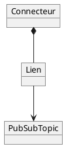

# PubSub Bridge

Le PubSub Bridge Adapter permet aux clients d'accéder aux messages de leur(s) projet(s) présents dans le courtier d’événements interne de Fundamentum. Ceci est fait en utilisant un **connecteur** et au moins un **lien**.

Les interactions avec le PubSub Bridge sont faites à partir des trois objets suivants : les **connecteurs**, les **liens** et les ***PubSub topics***.



Un **connecteur** contient l’information nécessaire pour que Fundamentum puisse se connecter à un courtier de messages externe. Un connecteur possède un type d’adaptateur qui dicte quel protocole sera utilisé pour communiquer avec ce courtier. Les possibilités sont MQTT, MQTTS ou HTTPS.

Les **liens** connectent un *topic PubSub* à un *topic* du broker externe via son connecteur. La direction, soit entrante ou sortante, dépend du type du *topic PubSub*.

Restrictions :  
- Pour les connecteurs MQTT(S), un même *topic* externe ne peut pas être utilisé à la fois pour un lien entrant et un lien sortant  
- Un seul lien entrant peut exister pour une paire donnée de *topic* externe et *topic PubSub*

Note : Un **lien entrant** est un lien pour publier des messages sur Fundamentum alors qu’un **lien sortant** est un lien pour recevoir des messages de Fundamentum.

Les ***topics PubSub*** sont des *topics* dans le courtier d’événements de Fundamentum, accessibles via le PubSub Bridge. Ils sont unidirectionnels : soit souscriptibles, soit publiables.

Les topics suivants sont créés par défaut pour chaque projet :  
- `projects.N.topics.states`
- `projects.N.topics.readings`
- `projects.N.topics.custom_actions`  

Les *topics PubSub* ont un type par défaut définissant leur direction (c.-à-d. s’ils peuvent être publiés ou souscrits). Les valeurs possibles sont :

- **States** : souscription uniquement  
- **Telemetry** : souscription uniquement  
- **Custom Actions** : publication uniquement  

Les noms des *PubSub topics* doivent contenir uniquement des caractères alphanumériques et avoir une longueur minimale de 3 caractères. Ils sont préfixés automatiquement par `projects.N.topics` où `N` est l’identifiant du projet.

## Mise en place

### MQTT & MQTTS


Pour utiliser un connecteur MQTT(S), vous aurez besoin d’un serveur MQTT accessible par Internet ainsi que d’un client MQTT pour pouvoir publier ou consommer des messages.

<details>
  <summary>Hub</summary>

  #### 1. Créer le connecteur

  Pour les connecteurs MQTT, les champs suivants sont disponibles :  
  - Hostname\* : Nom d’hôte du broker  
  - Port\* : Port du broker (habituellement 1883 pour MQTT et 8883 pour MQTTS)  
  - Client ID\* : Identifiant client utilisé par le client MQTT de Fundamentum  
  - Username : Nom d’utilisateur pour l’authentification par mot de passe  
  - Password : Mot de passe pour l’authentification par mot de passe  

  Les connecteurs MQTTS possèdent les champs additionnels suivants :  
  - CA Certificate\*\* : Fichier PEM contenant le certificat de l’autorité de certification  
  - Client Certificate\*\* : Fichier PEM contenant le certificat utilisé par le client MQTT  
  - Client Key\*\* : Fichier PEM contenant la clé privée associée au certificat client  

  \* Les champs suivis d’un astérisque sont obligatoires.  
  \*\* L’extension du fichier n’a pas d’importance, seul son contenu compte.

  1. Naviguez vers la page **Connectors**  
  2. Cliquez sur **New Connector**  
  3. Sélectionnez le type d’adaptateur (MQTT ou MQTTS)  
  4. Remplissez les champs  
  5. Cliquez sur **Save**

  Le connecteur est maintenant créé. Il tentera de se connecter à l’hôte spécifié. Pour vérifier si la connexion a réussi, utilisez le bouton **Status** de la page **Connectors**.

  #### 2. Créer le PubSub Topic
  
  Cette étape est optionnelle si vous utilisez un des *PubSub topics* créés par défaut.

  1. Naviguez vers la page **PubSub topics**  
  2. Cliquez sur **New Topic**  
  3. Remplissez les champs  
  4. Cliquez sur **Save**

  #### 3. Créer le lien
  
  1. Naviguez vers la page **Connectors**  
  2. Cliquez sur **Links**  
  3. Cliquez sur **New Link**  
     - Le premier tableau = liens sortants (souscription)  
     - Le second tableau = liens entrants (publication)  
     - La direction peut être modifiée dans la page du lien  
  4. Sélectionnez le *topic PubSub* et le *topic* externe  
  5. Cliquez sur **Save**

  #### 4. Publier ou souscrire

  Pour publier un message sur un lien entrant, il faut publier un message à votre broker MQTT sur le *topic* choisi au moment de créer le lien. Le message doit respecter le format suivant :

  ```json
  {
      "device_id": int,
      "registry_id": int,
      "version": string;optional,
      "data": string
  }
  ```

  - `device_id`, `registry_id` et `version` deviennent des en-têtes  
  - `data` devient le payload du message

  Pour obtenir les messages d’un lien sortant, il faut se souscrire à votre broker MQTT à l’aide du client MQTT de votre choix sur le *topic* choisi. Les messages reçus sur le *PubSub topic* sont transmis tels quels à ce *topic*.
</details>

<details>
  <summary>API</summary>

  #### 1. Créer le connecteur

  Appelez l’[API](https://api.fundamentum-iot.com/docs#/operations/storeConnector) pour créer le connecteur.

  Les clés-valeurs possibles pour le champ `connection_string` sont :
  - `host`\* : Nom d’hôte du broker  
  - `port`\* : Port du broker (habituellement 1883 pour MQTT et 8883 pour MQTTS)  
  - `clientid`\* : Identifiant client utilisé par le client MQTT de Fundamentum  
  - `username` : Nom d’utilisateur pour l’authentification par mot de passe  
  - `password` : Mot de passe pour l’authentification par mot de passe  

  Les connecteurs MQTTS possèdent les clés-valeurs additionnelles suivantes :
  - `ca_cert`\*\* : Contenu PEM du certificat de l’autorité de certification  
  - `client_cert`\*\* : Contenu PEM du certificat utilisé par le client MQTT  
  - `client_key`\*\* : Contenu PEM de la clé privée associée au certificat client  

  \* Les champs suivis d’un astérisque sont obligatoires.  
  \*\* Le contenu du fichier doit être utilisé comme valeur.

  Les champs `password`, `ca_cert`, `client_cert` et `client_key` doivent avoir la valeur `%{nom du champ}%` et leur vraie valeur dans le champ `placeholders`.

  Le connecteur est maintenant créé. Il tentera de se connecter à l’hôte spécifié. Pour vérifier si la connexion a réussi, utilisez l’[API](https://api.fundamentum-iot.com/docs#/operations/getConnectorStatus) avec l’identifiant obtenu lors de la création.

  #### 2. Créer le PubSub Topic
  
  Cette étape est optionnelle si vous utilisez un des *PubSub topics* créés par défaut.

  Appelez l’[API](https://api.fundamentum-iot.com/docs#/operations/storePubSubTopic) pour créer le *PubSub topic*.

  Vous pouvez voir les *PubSub topics* existants à l’aide de l’[API](https://api.fundamentum-iot.com/docs#/operations/listPubSubTopics).

  #### 3. Créer le lien

  Appelez l’[API](https://api.fundamentum-iot.com/docs#/operations/storeLink) pour créer le lien en utilisant l’identifiant du connecteur créé à l’étape 1 et l’identifiant du *PubSub topic* obtenu à l’étape 2.

  #### 4. Publier ou souscrire

  Pour publier un message sur un lien entrant, il faut publier un message à votre broker MQTT sur le *topic* choisi au moment de créer le lien. Le message doit respecter le format suivant:

  ```json
  {
      "device_id": int,
      "registry_id": int,
      "version": string;optional,
      "data": string
  }
  ```

  - `device_id`, `registry_id` et `version` deviennent des en-têtes
  - `data` devient le payload du message

  Pour obtenir les messages d'un lien sortant, il faut se souscrire à votre broker MQTT à l'aide d'un client MQTT à votre choix sur le *topic* choisi. Les messages reçus sur le *PubSub topic* sont transmis tels quels à ce *topic*.

</details>

### HTTPS


Pour utiliser un lien entrant d’un connecteur HTTPS, vous aurez besoin d’un serveur HTTPS accessible par Internet ainsi qu’une route qui accepte la méthode POST. Une requête sera effectuée sur cette route pour chaque message à transmettre.

Pour utiliser un lien sortant d’un connecteur HTTPS, vous aurez besoin d’un client HTTP.

<details>
  <summary>Hub</summary>

  #### 1. Créer le connecteur

  Les connecteurs HTTPS possèdent les champs suivants. Notez qu’ils sont utilisés uniquement pour les liens sortants :
  - Host : Nom de domaine du serveur HTTP (ex. https://www.example.com). La valeur doit commencer par `https://`.  
  - Custom Header Name : Nom de l’en-tête personnalisé.  
  - Custom Header Value : Valeur de l’en-tête personnalisé.  

  Si les champs "Custom Header Name" et "Custom Header Value" ont tous les deux une valeur, un en-tête HTTP avec ces valeurs sera ajouté à chaque message transmis par le connecteur.

  1. Naviguez vers la page **Connectors**  
  2. Cliquez sur **New Connector**  
  3. Sélectionnez le type d’adaptateur HTTPS  
  4. Remplissez les champs  
  5. Cliquez sur **Save**

  Le connecteur est maintenant créé. Il tentera de se connecter à l’hôte spécifié. Pour vérifier si la connexion a réussi, utilisez le bouton **Status** de la page **Connectors**.

  #### 2. Créer le PubSub Topic
  
  Cette étape est optionnelle si vous utilisez un des *PubSub topics* créés par défaut.

  1. Naviguez vers la page **PubSub topics**  
  2. Cliquez sur **New Topic**  
  3. Remplissez les champs  
  4. Cliquez sur **Save**

  #### 3. Créer le lien
  
  1. Naviguez vers la page **Connectors**  
  2. Cliquez sur **Links**  
  3. Cliquez sur **New Link**  
     - Le premier tableau = liens sortants (souscription)  
     - Le second tableau = liens entrants (publication)  
     - La direction peut être modifiée dans la page du lien  
  4. Sélectionnez le *topic PubSub* et la route  
     - La route est modifiable uniquement pour les liens sortants  
  5. Cliquez sur **Save**

  #### 4. Publier ou souscrire

  Pour publier un message sur un lien entrant, utilisez l’[API](https://api.fundamentum-iot.com/docs#/operations/publishLink) avec l’identifiant du lien et celui de son connecteur. 

  Le corps de la requête sera transformé en message :  
  - `device_id`, `registry_id` et `version` deviennent des en-têtes  
  - `data` devient le payload du message

  Lorsqu’un message est reçu sur le *PubSub topic* sélectionné, une requête HTTP sera faite à l’URL suivante : `POST {Host du connecteur}/{Route du lien}` avec le contenu du message comme corps de la requête.
</details>

<details>
  <summary>API</summary>

  #### 1. Créer le connecteur

  Appelez l’[API](https://api.fundamentum-iot.com/docs#/operations/storeConnector) pour créer le connecteur.

  Les clés-valeurs possibles pour le champ `connection_string` sont :

  Les connecteurs HTTPS possèdent les clés suivantes (utilisées uniquement pour les liens sortants) :
  - `host` : Nom de domaine du serveur HTTP (ex. https://www.example.com). La valeur doit commencer par `https://`.  
  - `headername` : Nom de l’en-tête personnalisé.  
  - `headervalue` : Valeur de l’en-tête personnalisé.  

  Si les clés `headername` et `headervalue` ont toutes les deux une valeur, un en-tête HTTP avec ces valeurs sera ajouté à chaque message transmis par le connecteur.

  Le connecteur est maintenant créé. Il tentera de se connecter à l’hôte spécifié. Pour vérifier si la connexion a réussi, utilisez l’[API](https://api.fundamentum-iot.com/docs#/operations/getConnectorStatus) avec l’identifiant obtenu lors de la création.

  #### 2. Créer le PubSub Topic
  
  Cette étape est optionnelle si vous utilisez un des *PubSub topics* créés par défaut.

  Appelez l’[API](https://api.fundamentum-iot.com/docs#/operations/storePubSubTopic) pour créer le *PubSub topic*.

  Vous pouvez voir les *PubSub topics* existants à l’aide de l’[API](https://api.fundamentum-iot.com/docs#/operations/listPubSubTopics).

  #### 3. Créer le lien
  
  Appelez l’[API](https://api.fundamentum-iot.com/docs#/operations/storeLink) pour créer le lien en utilisant l’identifiant du connecteur créé à l’étape 1 et l’identifiant du *PubSub topic* obtenu à l’étape 2.

  Pour un lien entrant, la valeur de `external_topic_name` peut être quelconque. Elle ne sera pas utilisée.

  Pour les liens sortants, la valeur de `external_topic_name` doit être la route du serveur HTTPS qui recevra les requêtes contenant les messages.

  #### 4. Publier ou souscrire

  Pour publier un message sur un lien entrant, utilisez l’[API](https://api.fundamentum-iot.com/docs#/operations/publishLink) avec l’identifiant du lien et celui de son connecteur.

  Le corps de la requête sera transformé en message :  
  - `device_id`, `registry_id` et `version` deviennent des en-têtes  
  - `data` devient le payload du message

  Lorsqu’un message est reçu sur le *PubSub topic* sélectionné, une requête HTTP sera faite à l’URL suivante : `POST {Host du connecteur}/{Route du lien}` avec le contenu du message comme corps de la requête.
</details>
