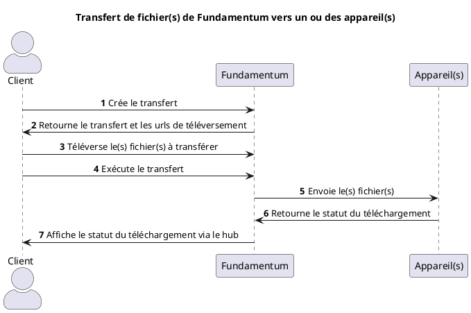
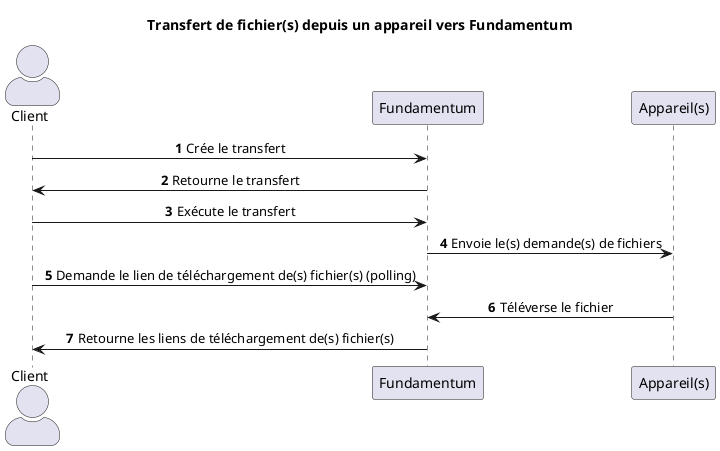

# Transfert de fichiers

Un transfert de fichiers peut se faire dans deux directions: de Fundamentum vers un ou des appareil(s),
ou d'un appareil vers Fundamentum.

## Transfert d'un ou plusieurs fichier(s) de Fundamentum vers un ou des appareil(s)

### En utilisant l'API

Vue d'ensemble



Étapes détaillées:

1. Création le transfert
   - Appelez l'[API](https://api.fundamentum-iot.com/docs#/operations/storeFileTransfer) pour créer un transfert avec la direction cloud-to-device 
   - Spécifiez la liste de fichiers que vous souhaitez transférer
   - Spécifiez la liste d'appareils auquel vous souhaitez transférer les fichiers
   - Le service vous retournera le transfert ainsi qu'une url de téléversement pour chacun des fichiers spécifiés

2. Obtention du transfert et des urls de téléversement

3. Téléversement du ou des fichier(s) à transférer
   - Pour chacun des fichiers indiqués dans le transfert: téléversez à l'aide de l'url présignée obtenue à l'étape 2

   ```shell
   curl --upload-file {CHEMIN_VERS_VOTRE_FICHIER} {URL_DE_TELEVERSEMENT}
   ```
   
4. Exécution du transfert
   - Appelez l'[API](https://api.fundamentum-iot.com/docs#/operations/executeFileTransfer) avec l'identifiant du transfert créé précédemment
   - Les fichiers à transférer doivent tous être téléversés

5. Envoi de(s) fichier(s)
  - Une requête par fichier sera ensuite envoyée au(x) appareil(s) spécifié(s)
  - Le edge daemon de chaque appareil recevra le transfert et émettra un évènement GRPC
  - Sur chaque appareil, vous devez avoir un programme qui écoute cet évènement GRPC, accepte le transfert, et télécharge le fichier à l'endroit spécifié
  - Vous pouvez voir le résultat du transfert dans l'onglet Actions de la page de votre appareil dans le Fundamentum Hub

### En utilisant le CLI de Fundamentum

Le CLI vous permet d'envoyer un seul fichier à un seul appareil. Il exécute les 3 étapes précédentes en une seule commmande.
Il faut d'abord authentifier le CLI:

```shell
fun login

fun devices transfer cloud-to-device -d {ID_DE_VOTRE_APPAREIL} -p {ID_DU_PROJET_DE_VOTRE_APPAREIL} \
   -r {ID_DU_REGISTRE_DE_VOTRE_APPAREIL} -f {CHEMIN_LOCAL_DU_FICHIER_À_TRANSFÉRER} \
   --remote-path {CHEMIN_SUR_L_APPAREIL_OÙ_SERA_SAUVEGARDÉ_LE_FICHIER} --context {CONTEXT_D_AUTHENTIFICATION_DU_CLI}
```

## Transfert d'un ou plusieurs fichier(s) d'un appareil vers Fundamentum

### En utilisant l'API

Vue d'ensemble



Étapes détaillées:

1. Création du transfert
   - Appelez l'[API](https://api.fundamentum-iot.com/docs#/operations/storeFileTransfer) pour créer un transfert avec la direction device-to-cloud
   - Spécifiez le ou les fichier(s) à demander
   - Vous ne pouvez cibler qu'un seul appareil

2. Obtention du transfert
   
3. Exécution du transfert
   - Appelez l'[API](https://api.fundamentum-iot.com/docs#/operations/executeFileTransfer) avec l'identifiant du transfert créé précédemment

4. Envoi de(s) demande(s) de fichiers
   - Une requête par fichier demandé sera envoyé à l'appareil spécifié
   - Le edge daemon de l'appareil recevra le transfert et émettra un évènement GRPC
   - Sur l'appareil, vous devez avoir un programme qui écoute cet évènement GRPC (voir plus bas), accepte le transfert, et y téléverse le fichier depuis l'endroit spécifié

5. Demander les fichiers (polling)
   - Appelez l'[API](https://api.fundamentum-iot.com/docs#/operations/getFileTransferFiles) avec l'identifiant du transfert créé précédemment
   - Si le fichier a été téléversé par l'appareil, cet API vous retournera l'url de téléchargement de celui-ci
   - Répétez cet appel plusieurs fois jusqu'à ce que vous obteniez l'url
   - Téléchargez le fichier depuis cet url

   ```shell
   curl -o {CHEMIN_OÙ_VOUS_VOULEZ_SAUVEGARDER_LE_FICHIER} {URL_DE_TÉLÉCHARGEMENT}
   ```

### En utilisant le CLI de Fundamentum

Le CLI vous permet de demander un fichier à un appareil. Il exécute les 3 étapes précédentes en une seule commmande.
Il faut d'abord authentifier le CLI:

```shell
fun login

fun devices transfer cloud-to-device -d {ID_DE_VOTRE_APPAREIL} -p {ID_DU_PROJET_DE_VOTRE_APPAREIL} \
   -r {ID_DU_REGISTRE_DE_VOTRE_APPAREIL} -f {CHEMIN_LOCAL_DU_FICHIER_À_TRANSFÉRER} \
   --remote-path {CHEMIN_SUR_L_APPAREIL_OÙ_SERA_SAUVEGARDÉ_LE_FICHIER} --context {CONTEXT_D_AUTHENTIFICATION_DU_CLI}
```

## Implémentation d'une application de transfert de fichiers sur l'appareil

### Proto

https://bitbucket.org/amotus/fundamentum-edge-proto

### Exemple (en Go)

Les dépendances Go utilisées:

```
google.golang.org/grpc v1.70.0
google.golang.org/protobuf v1.36.1
```

Autres outils:

[Protoc](https://protobuf.dev/installation/)

Générer les pb à partir des proto:

```shell
#!/usr/bin/env bash
set -euo pipefail
shopt -s nullglob

go install google.golang.org/protobuf/cmd/protoc-gen-go@v1.28
go install google.golang.org/grpc/cmd/protoc-gen-go-grpc@v1.2

cd "{{source_directory()}}/proto"
files=(*.proto **/*.proto)
opts=()
grpc_opts=()
for f in "${files[@]}"; do
  g=`realpath $f`
  opts+=( "--go_opt=M$f=$(dirname "path/to/proto/$f");$(basename "${g%/*}")" )
  grpc_opts+=("--go-grpc_opt=M$f=$(dirname "path/to/proto/$f");$(basename "${g%/*}")")
done
set -x
protoc --proto_path=. --go_out=. --go_opt=paths=source_relative "${opts[@]}" --go-grpc_out=. --go-grpc_opt=paths=source_relative "${grpc_opts[@]}" "${files[@]}"
```

Code:

```go
package main

import (
   "context"
   "crypto/sha512"
   "encoding/base64"
   "fmt"
   "io"
   "os"

   pb "path/to/pb" // pb générés à partir des protos

   "google.golang.org/grpc"
   "google.golang.org/grpc/credentials/insecure"
)

func ListenToFileTransfers(ctx context.Context, rpcUrl string) error {
   transportOptions := grpc.WithTransportCredentials(insecure.NewCredentials())
   conn, err := grpc.NewClient(rpcUrl, transportOptions)
   fileTransferClient := pb.NewFileTransferClient(conn)

   subscription, err := fileTransferClient.Subscribe(ctx, nil)
   if err != nil {
      return err
   }

   for {
      fmt.Println("Waiting for file transfer...")
      req, err := subscription.Recv()
      if err != nil {
         return fmt.Errorf("error receiving file transfer request: %w", err)
      }

      err = handleFileRequest(ctx, req)
      if err != nil {
         return fmt.Errorf("error handling file transfer request: %w", err)
      }
   }
}

func handleFileRequest(ctx context.Context, req *pb.FileTransferRequest) error {
   fmt.Println("Handling file request")
   if req.GetDownload() != nil {
      return handleDownload(ctx, req.GetActionId(), req.GetDownload().GetSize())
   }

   return handleUpload(ctx, req.GetActionId(), req.GetUpload().GetFilePath())
}

func handleDownload(ctx context.Context, actionId *pb.ActionId, size uint64) error {
   fmt.Println("Handling download")
   // This always accept requests for demo purposes, but we could refuse based on some criteria
   responseStream, err := fileTransferClient.DownloadFile(ctx, &pb.DownloadFileRequest{
      ActionId: actionId,
   })
   if err != nil {
      return fmt.Errorf("error handling download request: %w", err)
   }

   totalData := make([]byte, size)
   fmt.Println(fmt.Sprintf("Downloading %d bytes", size))

   // Receive all response chunks from the stream
   for {
      resp, err := responseStream.Recv()
      if err == io.EOF {
         fmt.Println("File download completed, all chunks received. File contents:")
         fmt.Println(string(totalData))
		 // TODO save file at remote path in request
         fmt.Println()
         break
      }
      if err != nil {
         return fmt.Errorf("error receiving file download chunk: %w", err)
      }

      chunkData := resp.GetChunk().GetData()
      fmt.Println(fmt.Sprintf("Copying data chunk from byte %d to %d", resp.GetChunk().GetIndex(), uint64(len(chunkData))+resp.GetChunk().GetIndex()))
      for i, b := range chunkData {
         totalData[resp.GetChunk().GetIndex()+uint64(i)] = b
      }
   }

   return nil
}

func handleUpload(ctx context.Context, actionId *pb.ActionId, filePath string) error {
   fmt.Println("Handling upload")
   // This always accept requests for demo purposes, but we could refuse based on some criteria
   responseStream, err := fileTransferClient.UploadFile(ctx)
   if err != nil {
      return fmt.Errorf("error creating upload stream: %w", err)
   }
   fmt.Println(fmt.Sprintf("Reading test file to upload (filePath=%s)", filePath))
   data, err := os.ReadFile(filePath)
   if err != nil {
      return fmt.Errorf("error reading test file: %w", err)
   }

   hash512 := sha512.Sum512(data)
   sriHash := "sha512-" + base64.StdEncoding.EncodeToString(hash512[:])

   fmt.Printf("Uploading headers (actionId=%d, size=%d, hash=%s)\n", actionId.GetId(), uint64(len(data)), sriHash)
   err = responseStream.Send(&pb.UploadFileRequest{
      Payload: &pb.UploadFileRequest_Header_{Header: &pb.UploadFileRequest_Header{
         ActionId: actionId,
         Size:     uint64(len(data)),
         Hash:     sriHash,
      }},
   })
   if err != nil {
      return fmt.Errorf("error sending upload header: %w", err)
   }
   start := uint64(0)
   fmt.Println("Uploading test file contents")
   err = responseStream.Send(&pb.UploadFileRequest{
      Payload: &pb.UploadFileRequest_Chunk_{Chunk: &pb.UploadFileRequest_Chunk{
         Inner: &pb.FileChunk{
            Index: &start,
            Data:  data,
         },
      }},
   })
   if err != nil {
      return fmt.Errorf("error sending upload chunk: %w", err)
   }
   _, err = responseStream.CloseAndRecv()
   if err != nil {
      return fmt.Errorf("error closing upload streanm: %w", err)
   }
   fmt.Println("Upload complete")
   fmt.Println(string(data))
   fmt.Println()
   return nil
}
```