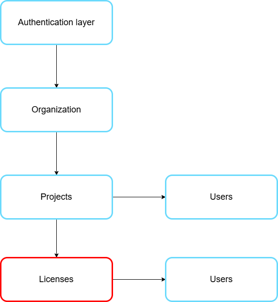

# Licences

This section allows you to manage user permissions and their access rights to the platform based on their subscription plans (licenses). 

<figure><figcaption></figcaption></figure>

<figure><figcaption></figcaption></figure>

**How to create a license:**

1. Click on the Create License button at the top right of the page.

<figure><figcaption></figcaption></figure>

2. Fill in the information in the form (license name, type).

<figure><figcaption></figcaption></figure>

3. Confirm the creation by clicking Create License.

<figure><figcaption></figcaption></figure>

The new license will then be added to the list and can be assigned to users to manage their access and permissions on the platform.

**Create a license user :** \
\
1\. Select the license

From the list of licenses, click on the license for the user you want to create.

<figure><figcaption></figcaption></figure>

2. Accessing the user list

A page will appear showing the list of users associated with this license, along with their roles.\
At the top right of the page, click the New User button.

<figure><figcaption></figcaption></figure>

3. Filling out the form

Complete the following fields:\
Role\
Name\
Email\
language

<figure><figcaption></figcaption></figure>

4. Validation

Click Create to confirm the creation of the user.

<figure><figcaption></figcaption></figure>

**Create a license site:**

1. Selecting the license

From the list of licenses, click on the license for the site you want to create.

<figure><figcaption></figcaption></figure>

2. Accessing the list of sites

A page will appear with the list of users associated with this license. Click on Sites next to the users to display the list of sites associated with this license.

<figure><figcaption></figcaption></figure>

<figure><figcaption></figcaption></figure>

3. Filling out the form

At the top right of the page, click the New Site button.

<figure><figcaption></figcaption></figure>

Fill in the following fields:\
Name\
Address

<figure><figcaption></figcaption></figure>

4. Validation

Click Create to confirm the creation of the site.

<figure><figcaption></figcaption></figure>

