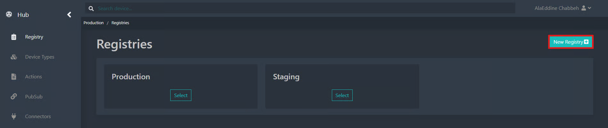

# Registry

**Registries** are logical containers that allow you to organize your devices in a structured way. Each registry can contain multiple devices and has its own configuration.

#### Create a New Registry

To create a new registry, follow these steps:

1. Click the **New Registry** button.

<figure><figcaption></figcaption></figure>

2.  Enter the required information:

    **Name**: Unique identifier of the registry.\
    **Provisioning configuration**:

    * **Start At**
    * **End At**

    <figure><figcaption></figcaption></figure>

3. Click **Save** to confirm the creation of the registry.

<figure><figcaption></figcaption></figure>

#### Registry Configuration

To configure an existing registry, proceed as follows:

1. In the **Registries** section, select the registry to configure by clicking the corresponding **Select** button.

<figure><figcaption></figcaption></figure>

The registry configuration page is displayed. It consists of three tabs:

* **Configuration**
* **PubSub Topics**
* **Advanced**

<figure><figcaption></figcaption></figure>

#### Configuration Tab

This tab allows you to view and modify the general settings of the registry:

* **Registry general settings (Information)**
* **Self Provisioning:**
  * **Start At**
  * **End At**
* **Device Limits**
* **Download Token file**

To modify a setting, click the pencil icon next to the relevant item.

<figure><figcaption></figcaption></figure>

#### PubSub Topics Tab

This tab displays the list of PubSub topics associated with the registry.\
Each topic can be modified individually.

To edit a topic’s settings, click the pencil icon on the corresponding row.

<figure><figcaption></figcaption></figure>

To add a new PubSub connection, follow these steps:

1. In the **PubSub Topics** tab, click the **New connection** button.

<figure><figcaption></figcaption></figure>

2. Fill in the required fields:

* **Topic type**
* **MQTT name**

Associate the connection with an existing **PubSub Topic**.

<figure><figcaption></figcaption></figure>

3. Save the configuration to complete the connection setup.

#### Advanced Tab

This tab provides access to advanced options and special configuration settings for the registry.\
It also allows you to delete a registry from this interface.

<figure><figcaption></figcaption></figure>

#### Download Token File

The provisioning file download button, located at the top right of the page, allows you to obtain a configuration file for your devices.\
This file contains the necessary information to enable devices to connect to the registry.

<figure><figcaption></figcaption></figure>

