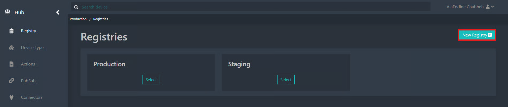

# Première connexion

Cette section décrit les étapes à suivre pour qu’un nouvel utilisateur puisse accéder à la plateforme Fundamentum.\
\
**1. Invitation par un des administrateurs du projet (licence)**

L’administrateur d'un projet (licence) au sein d'une organisation est responsable de la gestion des comptes et des permissions des utilisateurs.

Une fois le compte créé, le nouvel utilisateur reçoit automatiquement une **invitation par courriel** pour rejoindre la plateforme.\
\
**2. Acceptation de l’invitation**

Le nouvel utilisateur doit :

2.1 Ouvrir le courriel d’invitation reçu.

2.2 Cliquer sur le lien fourni pour compléter votre compte.

\
2.3 Suivre les instructions et créer un mot de passe personnel.

<figure><figcaption></figcaption></figure>

<figure><figcaption></figcaption></figure>

2.4 Cliquer sur Enregistrer

**3. Connexion à la plateforme Fundamentum**&#x20;

Une fois le compte activé, l’utilisateur peut se rendre sur l’adresse suivante pour se connecter\
[https://oauth.fundamentum-iot.com/authx/login](https://oauth.fundamentum-iot.com/authx/login)

<figure><figcaption></figcaption></figure>

\
